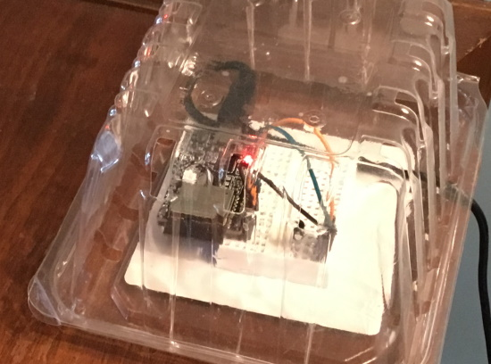

# Controller for a common 3-way electric heater

I love these heaters for their quietness, portability, and safety, but they don't do a very good job of determining when to turn on and off.  And they don't decide _at all_ what power level to use; you have to set that.  The result is sometimes it is too hot, sometimes too cold---even when the heater could do the job perfectly.  I have several of these heaters, and one of them stopped working one day, and so this project was born.

To make the heater perform better, I had two key objectives:
* Use a remote temperature sensor, for better accuracy.
* Have the heater automatically switch between different power levels.

I used two [ESP32-C3 boards](https://docs.espressif.com/projects/esp-idf/en/latest/esp32c3/hw-reference/index.html), one for the heater and one for the temperature sensor, which communicate using the built-in WIFI capabilities of the board.  The code for both is in this project, and in the xxx section below I will walk through the hardware and software configuration for this project.

If you want to develop a controller for a heater, this code could serve as a starting point or inspiration.  I've also tried to separate different functions out so they can be understood and used independently.  But you would use them by copying the code into your own project, not as a "component" (in the ESP32 or Arduino sense).

## System Features

### Independent temperature station
This extremely simple project just attaches a temperature sensor to an ESP32-C3 and broadcasts the current temperature at intervals.

### Power Controller
The main function of the power controller is to determine which heater elements) should be on.  Most of these heaters have two elements of two different wattages (mine are 650W and 850W), which can be turned on independently or together, resulting in three heating levels.  The logic decides what level to set based on how far the current temperature is from the desired temperature.  It also measures the temperature of the heater itself (using the onboard temp sensor on the ESP32 board itself) to keep the heater from getting too hot.

### Console 
Interaction with the heater controller is through the console, which is a very simple python program on the client side, and the matching module on the controller side.  Almost all communication is done via broadcast UDP, which greatly simplifies setup and management.  This works fine in a home WIFI environment like mine, but would obviously not be sufficient in larger or public networks.

Typing '?' in the python client will show a list of available commands.

### Desired Temperature Management
Among the things that are available in the console are three commands related to setting the desired temperature:
* Temperature schedule:  A 24-hour schedule of integer temperature values to model varying temperature desired throughout a day.  This is stored persistently on the board and is used as soon as the system boots.
* "Bump" operation: A temporary override of the schedule for the next n hours.  Just feeling a little chilly right now?  Bump the temperature for the next two hours!
* Manual set heater level: Just like the original heater controls, you can also just set the level you want directly.  (This is still subject to the overheating logic, however.)

### OTA Update
The ESP32 boards have a built-in capability to update "Over the Air" via WIFI.  This means you can modify the code, and then just load it directly to the microprocessor, no cables required.  There are good sample demos of this capability with the Espressif docs; the only thing I did differently is use plain TCP to make the connection, rather than HTTPS.  This simplifies the code somewhat on both sides, but again is only appropriate on a private home WIFI network.

Given that the microprocessor is inside the heater case, OTA update saves me from having to literally disassemble the heater to make modifications to the code: a huge plus!

### Messaging
The heater controller responds to console requests and emits log messages over UDP.  The messages are queued from multiple tasks and sent by a single dedicated task.  The queuing code is designed for this multi-producer, single-consumer case, and also discards older messages rather than blocking, if the queue would overflow.

### Initial Time Setup
It is most common to set time via sntp, but that doesn't come with timezone or DST information.  So I use a designed-for-IOT service called [worldtimeapi.org] instead.  Right now the system only checks that on boot, so a change in daylight savings time requires rebooting the controller.  If you wanted, however, the information from worldtimeapi would allow you to track when the next DST change is for your time zone, and update automatically.

## About the Code

The two subdirectories `temperature_station` and `3way_controller` are [Espressif IDF](https://docs.espressif.com/projects/esp-idf/en/latest/esp32c3/get-started/index.html) projects for the temperature sensor and the heater controller respectively.  I use the Espressif build process (`idf.py build`) to build the code and then either flash it to the controllers using idf (`idf.py flash`) or send it via OTA (using the console).

Configuration is hybrid:  The Espressif IDF `sdkconfig` files are used for any config that IDF or IDF libraries need.  The config parameters introduced for this project are in the file `./3way_controller/components/lib/include/libconfig.h` (and in some cases mirrored in `temperature_station.c` and/or `console.py`).  I tried to make it easier to understand and possibly re-use the code this way.

The dependencies on the Espressif libraries include: the FreeRTOS task library, the Wifi configuration code, all the OTA stuff, and the ability to read/write to persistent flash storage.  Most of this is isolated enough that it should be possible to port the code to a different system (caveat I haven't tried that myself).

## Putting the Project together

### Parts
There really aren't many parts to the project: two microprocessor boards, two high-amp switches, a temperature sensor, and the wiring etc. to put it together.

I chose the [ESP32-C3](https://docs.espressif.com/projects/esp-idf/en/latest/esp32c3/hw-reference/index.html) for a couple of reasons:
* Integrated WIFI on board
* High heat tolerance (up to 140C)
* Inexpensive (only $8)

For the high-amp switches, which supply power to the heater elements, I used the [Adafruit Power Relay unit](https://www.adafruit.com/product/3191), and the temperature sensor is a [TMP36](https://www.adafruit.com/product/165) (though I am sure literally any such sensor could be used.)

For power supply, I just re-used a couple of the pile of old device chargers I have lying around.

This is the first Arduino-ish project I have done, so I don't make any claims that these are necessarily the best parts.

### Temperature Station

The temperature station is cute and can be summarized with a single picture:

Yes, that is a strawberry carton I am using as a light protective cover.  And I happened to have this small stick-on breadboard, so I decided to just use that instead of a pcb board.

### The Heater

For the heater, we have three somewhat bulky mini-boards (aka featherwings aka bricks).  Because of the hieght of the power switches, they can't be mounted vertically, shield style, so I mounted them to a small pcb board.  Because they are a bit big and I only needed access to a few pins, I mounted them dangling off the board.

As you can see there is very little wiring required: just the power and switching logic to the switches.  This is my first project soldering wires in a few decades, so I think it came out okay.  (I did end up buying a new soldering iron for this project, which made a **huge** difference.)

The most challenging part of the project was figuring out how to mount all the parts in the heater case.  It is smooth powder-coated metal and I didn't want to poke a lot of screw holes.  I removed the previous thermostat and controls, which gave me a few places I could attach something.   I mounted the pcb board on bolts into a plastic part where a fancy button had been mounted.   (I don't have a good pic of this; sorry.)

That left the power supply to figure out.  This ended up being the most "questionable-judgment" part of the whole project :-)  I wanted the heater to be a single unit, so the processor should be powered off the same supply as the heater itself.  I debated:
1. Buy an AC-DC converter component (assuming such a thing exists) and add it to the PCB board.
2. Crack open a charger unit, extract the AC-DC converter from within, and figure out how to mount that.
3. Just use the charger unit itself, and figure out how to attach power to the charger plug, and how to mount the charger unit inside the case.

I went with (3) since it just bugged me to buy a part that I already have in abundance, and I wasn't sure that extracting the converter from the charger packaging would actually result in a safer construction than using the charger as-is.   (Hint: if you want to use an old charger this way, make sure its output voltage and amperage are appropriate.  In this project in particular, each high-amp switch pulls about 100mA when operating, and some chargers wouldn't output enough current.)

So here is how I attached the power to the plug:  I used some relatively stiff steel wire (a bit heavier than chicken wire) and wrapped it as tightly around each plug blade as I could.  This made a kind of "clip" that would force the braided wire of the power cord against the plug blade.  I assembled that and then wrapped first each blade then the whole plug with rubber electrical tape.  This wouldn't be sufficient if the power wire could be yanked on, but because of the way everything is mounted, I think it will be okay.   (Disclaimer: _please_ keep in mind I am an amateur at this; no warranties of safety or fitness for use, etc., etc.)

Then came mounting the charger inside the case.  I didn't think any adhesive I had would work given the materials and the temperature inside the case.  I finally came up with using wire (the same wire as above) to make a cage mounted to the clips of the old switches.  It looks kludgy as all hell, but I think it will hold.

The rest was just connecting the power supply wires, testing it out, and putting it all together!  I used [WAGO connectors](https://www.wago.com/us/discover-wire-and-splicing-connectors/221) instead of wire nuts, since (1) I felt more confident about doing multi-way splits with varying wire gauges this way and (2) I could repeatedly connect and disconnect them without damaging the wires.

One final little touch:  I use the on-board color LED of the ESP32-C3 board for status.  This LED isn't aimed at the front of the unit and it doesn't have any dedicated opening.  Instead it just kind of seeps out the air holes of the case.  This is kind of pretty and not as in-your-face as most status LEDs.

